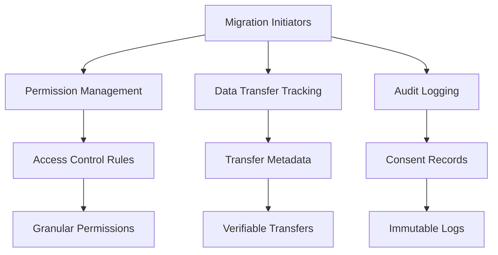

# Parallel Migrate Utility

A blockchain-powered smart contract utility that enables secure, distributed data migration and tracking across decentralized systems, with robust access control and comprehensive audit mechanisms.

## Overview

The Parallel Migrate Utility provides a flexible framework for managing complex data migration scenarios with the following core capabilities:

- Secure and verifiable data transfer protocols
- Fine-grained access control and permission management
- Comprehensive tracking of data movement and transformations
- Immutable audit trails and consent records
- Extensible architecture for diverse migration use cases

The platform empowers organizations to execute complex data migrations with unprecedented transparency, security, and traceability.

## Architecture

The system is built around a central smart contract that manages:



Core components:
- Flexible permission modeling
- Transfer metadata tracking
- Consent and audit logging
- Adaptable migration protocols
- Secure access management

## Contract Documentation

### parallel-migrate.clar

The core contract managing data migration protocols and tracking mechanisms.

#### Key Features:

1. **Permission Management**
   - Dynamic access control configuration
   - Granular permission scoping
   - Revocable transfer rights

2. **Migration Tracking**
   - Comprehensive transfer logging
   - Metadata preservation
   - Consent-based data movement

3. **Audit and Compliance**
   - Immutable transfer records
   - Detailed provenance tracking
   - Transparent migration workflows

## Getting Started

### Prerequisites
- Clarinet
- Stacks wallet

### Installation

1. Clone the repository
2. Install dependencies:
```bash
clarinet install
```

3. Test the contract:
```bash
clarinet test
```

### Basic Usage

1. Register a user:
```clarity
(contract-call? .health-mesh register-user (some "John") (some "profile-url"))
```

2. Register a device:
```clarity
(contract-call? .health-mesh register-device "device-123" "smartwatch")
```

3. Grant data access:
```clarity
(contract-call? .health-mesh grant-data-permission 
  GRANTEE_PRINCIPAL 
  "heart-rate" 
  u86400 
  "research-study")
```

## Function Reference

### User Management

```clarity
(register-user (name (optional (string-utf8 50))) (profile-data-url (optional (string-utf8 256))))
(update-profile (name (optional (string-utf8 50))) (profile-data-url (optional (string-utf8 256))))
(deactivate-account)
```

### Device Management

```clarity
(register-device (device-id (string-utf8 64)) (device-type (string-utf8 50)))
(update-device-sync (device-id (string-utf8 64)))
(remove-device (device-id (string-utf8 64)))
```

### Data Access Control

```clarity
(grant-data-permission (grantee-id principal) (data-type (string-utf8 30)) (duration uint) (purpose (string-utf8 100)))
(revoke-data-permission (grantee-id principal) (data-type (string-utf8 30)))
(record-data-access (user-id principal) (data-type (string-utf8 30)))
```

### Community Features

```clarity
(create-health-challenge (name (string-utf8 100)) (description (string-utf8 256)) ...)
(join-challenge (challenge-id uint))
(submit-challenge-completion (challenge-id uint))
(claim-challenge-reward (challenge-id uint))
```

## Development

### Testing

Run the test suite:
```bash
clarinet test
```

### Local Development

1. Start Clarinet console:
```bash
clarinet console
```

2. Deploy contract:
```bash
clarinet deploy
```

## Security Considerations

1. **Data Privacy**
   - All actual health data is stored off-chain
   - Only encrypted storage references are maintained on-chain
   - Granular permission control with expiration

2. **Access Control**
   - Time-bound permissions
   - Revocable access rights
   - Transparent consent tracking

3. **Limitations**
   - Contract cannot guarantee off-chain data deletion
   - Users should review permissions regularly
   - Research contributions are one-way and cannot be withdrawn